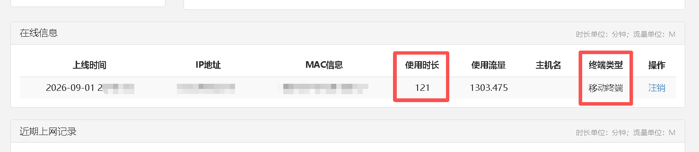
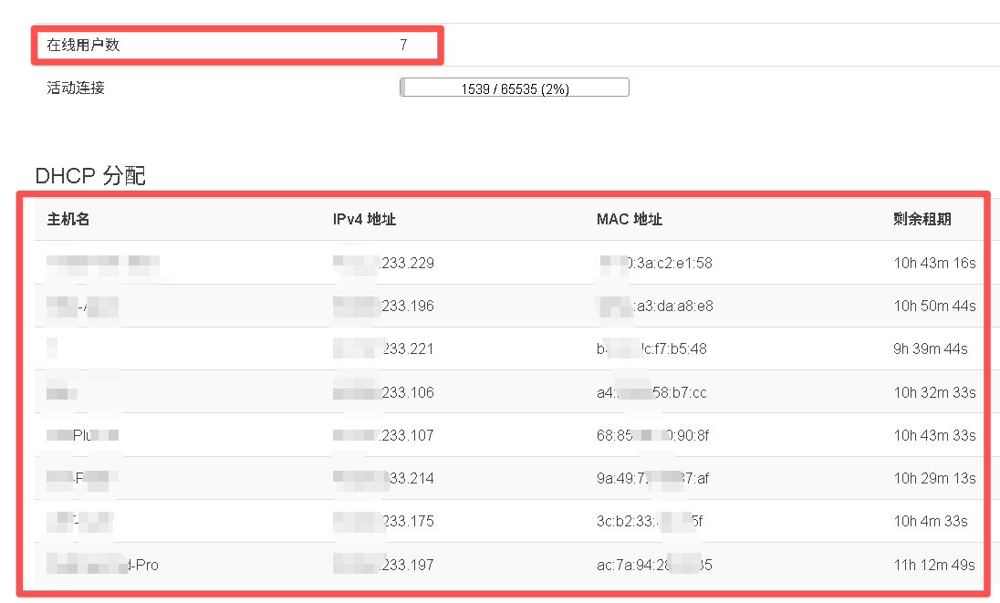

#### 📃 介绍
本文章针对福建农林大学仓山校区宿舍校园网的设备数量限制进行破限，经过 8 台设备长达 120 多分钟（截止开源时已正常运行超过12小时）的测试，可以正常使用。

理论上“核心思路”可以对全国 80% 以上的高校通用，**特别是采用 Dr.COM / 哆点 ePortal 认证系统的**。

💡 如何适配其他学校？
如果你想将此方案推广到其他学校，只需做以下三步适配：
   1. **抓包获取本地参数**：用 F12 抓取目标学校的登录请求，提取其 API 路径、端口、加密密钥、回调函数名。
   2. **识别认证系统厂商**：通过页面源码关键词判断是 Dr.COM、锐捷（Mentohust/Minieap）、深信服、还是城市热点（CityHot），不同厂商的防检测侧重点不同。
   3. **测试保活接口**：找到目标学校网关的“心跳探针”资源（不一定是 b111.jpg，可能是其他图片或特定的 /keepalive 接口）。




**需要一台刷了 OpenWrt 或其他衍生系统的路由器。**

逆向过程发现了两处很聪明的设计：
1. 打开数字FAFU，**会扫描局域网拓扑并向校园网服务器“打小报告”**，从而被检测进而被风控。**所以打开数字FAFU的时候要注意不能用WIFI，要用流量。**
2. 校园网登录页面有JS探针，会获取真实局域网IP，如果后台发现你的内网IP是 192.168.x.x（说明你躲在路由器后面），就会上风控 **（网络故障146的其中一个原因）**；同时，JS探针会读取并上报真实的浏览器UA，如果 **与登录账号时所记录的UA不一致**，也可能触发风控。**所以登录时尽量使用UA2F中自定义的UA终端，尽量不访问校园网登录页、Dr.COM（哆点）或其他校园网相关网页。**

#### 📄 开源协议
本技术原理采用 MIT License 开源协议。

#### 🚨 免责声明
**1. 本项目仅供网络安全研究与学习交流使用，严禁传播，严禁商用，严禁用于不法用途！因使用本工具产生的一切后果由使用者自行承担。🚫**

**2. 请遵守学校相关管理规定，切勿用于恶意逃避监管，倡导遵规守纪！🙏**

**3. 我不提供帮助，感谢理解！🤝**

#### 💻 技术原理
##### 一、 OpenWrt 路由器基础配置
1. **MAC 克隆**：在 WAN 口设置中，克隆已成功登录认证过的 PC/移动终端 的 MAC 地址（可以在自助服务系统页面查看）。**这里很重要！用的如果是在登录时被后台记录为 PC 的 MAC 地址，则 UA2F 插件中，UA 也应该填写 PC 的 UA ，反之亦然** 。
2. **冷门 LAN 网段**：将 LAN 口 IP 修改为冷门私有网段（如 `172.31.255.1`），规避前端 JS 探针对常见网关 IP（如 `192.168.x.x`）的扫描。
3. **彻底关闭 IPv6**：删除或禁用 `WAN6` 接口；在 LAN 口 DHCP 设置中全面禁用 **RA、DHCPv6、NDP** 服务，防止 IPv6 穿透暴露多设备。
4. **配置 UA2F 插件**：安装 UA2F 。假如你 MAC 克隆的是被后台记录为 PC 的MAC地址，则将自定义 User-Agent 统一设为 `Mozilla/5.0 (Windows NT 10.0; Win64; x64) AppleWebKit/537.36 (KHTML, like Gecko) Chrome/150.0.0.0 Safari/537.36 Edg/150.0.0.0` **（最好是用自己登录时向服务器请求的UA）**，伪装所有 HTTP 流量为单一 Windows 电脑。
5. **Cron 定时保活**：在 OpenWrt 系统 -> 计划任务 中添加定时脚本：
   ```
   # 每 5 分钟向 Dr.COM 核心网关 (端口80) 发送原生心跳探针 (b111.jpg)
   # 携带伪造的 Windows UA 和 Referer，完美伪装成 PC 端网页的后台静默心跳
   */5 * * * * curl -s -o /dev/null -H "User-Agent: Mozilla/5.0 (Windows NT 10.0; Win64; x64) AppleWebKit/537.36 (KHTML, like Gecko) Chrome/150.0.0.0 Safari/537.36 Edg/150.0.0.0" -H "Referer: http://210.34.84.127/b80.css" "http://210.34.84.127/b111.jpg"
   ```

#### 二、 防火墙深度伪装规则 (iptables)
在 OpenWrt `网络 -> 防火墙 -> 自定义规则` 中添加以下规则：
1. **锁定 TTL 值**：`iptables -t mangle -A POSTROUTING -o <你的WAN口名> -j TTL --ttl-set 64` （防路由跃点检测）。
2. **抹除 TCP 时间戳**：`iptables -t mangle -A POSTROUTING -p tcp -j TCPOPTSTRIP --strip-options timestamp` （防多操作系统时钟指纹识别）。
3. **拦截广播/组播**：
   - 丢弃广播/组播：`iptables -A FORWARD -m pkttype --pkt-type broadcast -j DROP` / `multicast -j DROP`
   - 丢弃局域网发现协议：封锁 SSDP(`1900`)、mDNS(`5353`)、SMB(`445`)、NetBIOS(`137:138`) 端口，防止内网设备向外网“打招呼”。
4. **DNS/NTP 劫持**：重定向 UDP 53 和 123 端口至路由器，由路由器统一向公共 DNS/NTP 服务器发起请求，抹除多设备的侧信道特征差异。
